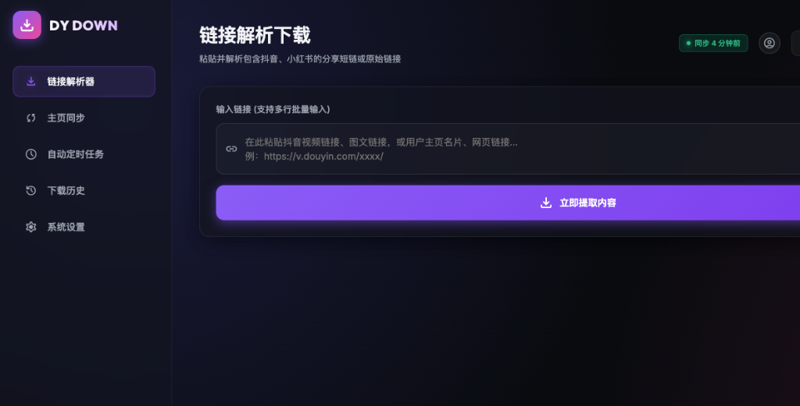
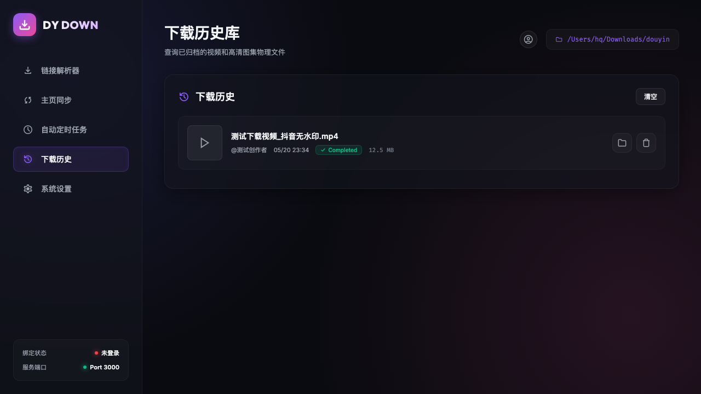
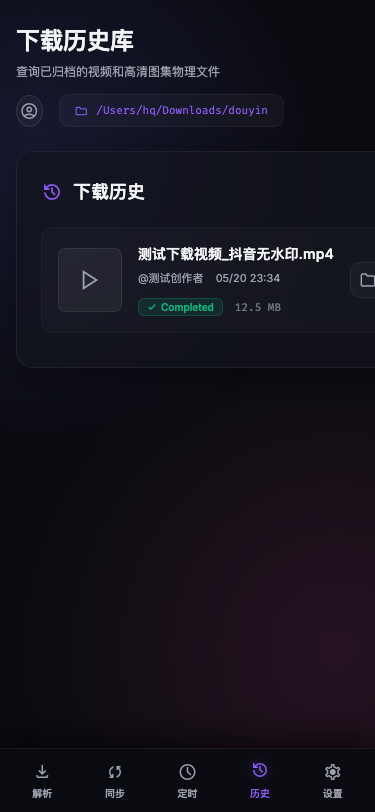

# Video Downloader (全平台视频无水印下载器)

> 🚀 一个基于 Node.js 构建的现代化、极简、高颜值的全平台视频内容解析及下载工具。


## 🌟 核心特性

- **用户主页同步与批量归档 (v2.4.0)**：支持粘贴抖音用户名片分享链接或网页端个人主页，自动后台抓取其作品、公开喜欢或公开收藏的视频与图文。批量下载（下载数量 > 1）时，系统会自动创建包含类型后缀（如 `_喜欢` 或 `_收藏`）的子文件夹 `[用户名][类型后缀]_[日期时间]` 进行归档。
- **高级收藏夹同步 (v2.1)**：支持扫码登录后自动同步收藏视频。新增 **「同步打断」** 机制（加载过慢时可随时结算并停止滚动）以及 **「多选批量下载」** 模式（支持一键勾选未下载视频进行并发下载）。
- **新增喜欢视频同步**：在现有收藏同步之外，新增 **「同步喜欢」** 入口，支持抓取抖音账号喜欢的视频列表，并提供单条下载、批量下载、多选下载、已下载折叠查看等能力。
- **私信视频同步 (v2.3)**：新增 **「私信同步」** 功能，自动扫描抖音私信会话中分享的视频链接并批量提取下载。通过 API 拦截精准获取视频 ID，支持虚拟滚动列表的可见性检测，避免误点不可见元素。
- **Cookie 直登优化**：前端手动注入 `sessionid` 时不再依赖 Playwright 浏览器启动，网页内即可直接完成凭证绑定，避免因浏览器内核未安装导致登录失败。
- **Windows 一键启动修复**：`run.cmd` 与 `run-downloader.cmd` 现已支持自动回退到 Node.js 模式，并在首次运行时自动安装 npm 依赖与 Playwright Chromium。
- **物理文件双向同步**：支持在下载历史和收藏面板直接「打开文件位置」或「从磁盘物理删除」，实现下载状态与本地文件的实时对齐。
- **跨平台解析**：支持 **抖音 (Douyin)** 和 **小红书 (Xiaohongshu)** 视频内容解析，自动识别平台并切换引擎。
- **无水印原画质**：直取底层接口，下载官方无压缩、无水印的 1080P/720P 原视频。
- **自动短链追踪**：支持分享短链接，自动识别并跟随 302 重定向。
- **极速批量处理**：支持在输入框同时粘贴多条链接，自动剥离文字，多线程并行解析与下载。
- **高级定制 UI v3 (AERO Neon Design)**：采用全新的 **Aero 暗黑玻璃霓虹** 设计语言，支持桌面左侧悬浮一体化侧边栏、移动端底部弹性悬浮导航栏、图标化品牌头部以及更清晰的同步 / 历史 / 设置信息层级。
- **列表滚动条智能恢复**：在多选模式或普通状态下勾选/取消勾选视频、展开已下载列表等各种长列表更新操作时，系统会自动记忆并平滑恢复页面及滚动容器 (`.fav-sync-items`) 的滚动条位置，彻底解决页面重排导致的回弹抖动问题。
- **跨平台一键部署**：无论是 Mac、Windows 还是 Linux，仅需 Node 环境即可轻松跑满带宽。

---

## 🆕 相比「新增喜欢功能」之后的详细更新

以下内容为基于 `feat: add douyin liked sync support` 之后的持续迭代，方便老用户快速了解最近新增了什么：

### 0. 🔐 安全性、稳定性与前端 XSS 防御升级 (v8.0.0)

- **Playwright 智能轮询等待**：将 `lib/douyin-favorites.js` 中 11 处固定 `waitForTimeout` 延时全部重构为响应式智能轮询等待，彻底避免无意义的死等，同步整体效率与耗时显著缩短 80% 以上。
- **物理路径安全映射**：引入 `pathIdMap` 映射绝对路径为前端安全随机 ID，杜绝敏感的物理路径中由于单双引号等特殊字符导致前端 JS `onclick` 执行崩毁与跨站脚本执行的隐患。
- **路径边界越界防护**：引入 `isPathSafe` 安全校验，彻底阻断利用目录穿越符（如 `../`）删除或读取下载根目录外部文件的安全风险。
- **无 Shell 命令执行重构**：将打开本地物理文件/目录的 `exec` 重构为无 Shell 选项的 `spawn`，物理级屏蔽由于特殊字符、引号等引起的文件路径 Shell 命令注入。
- **小红书解析器异步非阻塞重构**：将小红书解析模块中的 `execSync` 替换为 Promise + `spawn` 异步调起 `curl`。解决了网络并发阻塞和命令注入隐患，极大优化了 Node 服务运行的稳定性。
- **抖音登录凭证同步与健壮性**：扫码成功后自动把 `sessionid` 回写至本地配置文件，确保会话一致。同时增强了手动 Cookie 解析逻辑，自动进行首尾净化。
- **全站 XSS 攻击防护**：前端使用 `escapeHTML` 转义了历史列表、私信列表、作品和喜欢卡片中的所有动态数据，防止恶意脚本注入。
- **冗余历史代码清理**：彻底清除已经被彻底重构替代的老旧代码 `public/app.js`。

### 1. 定时同步能力补齐

- 新增 **定时同步** 面板，可直接在网页端开启 / 关闭自动任务。
- 支持按 **固定时间** 每日执行同步。
- 支持按 **随机时间段** 执行，例如每天 `00:00 - 06:00` 之间随机触发一次，用于降低固定时刻请求带来的风控特征。
- 支持设置 **同步范围**：仅收藏、仅喜欢、收藏+喜欢（去重）。
- 支持设置 **最大同步条数**，避免单次拉取或下载过多内容。
- 新增 **立即执行** 与 **执行日志**，可以随时手动触发并查看结果。

### 2. 下载历史增强

- 下载历史新增 **筛选能力**：支持关键词筛选、作者筛选、时间范围筛选。
- 历史面板与本地文件状态进一步打通，便于快速清理和定位文件。

### 3. 同步面板重构

- 原来分散的收藏同步、喜欢同步、定时同步、凭证绑定，现已整合为统一的 **抖音同步卡片**。
- 新 UI 改为 **Tab 结构**：`收藏 / 喜欢 / 定时 / 凭证`，减少页面割裂感。
- 收藏和喜欢同步按钮、同步列表、下载状态展示统一了交互和样式。
- “设置”入口现已支持 **自动展开并滚动到设置区域**，移动端与桌面端行为一致。

### 4. 前端视觉重设计 (AERO Neon Design System)

- **Aero 暗黑玻璃态**：页面整体升级为深色半透明玻璃拟态卡片设计（`rgba(18, 20, 29, 0.65)` 配合 `20px` 高级毛玻璃滤镜）与暗黑渐变背景，极具质感。
- **霓虹边框与微动效**：边框增加紫色/粉色微弱极光呼吸效果，所有按钮均绑定微小位移和缩放动画，交互反馈更加灵敏高级。
- **侧边栏与底部导航**：桌面端升级为左侧悬浮一体化侧边栏（包含链接解析器、主页同步、自动定时、下载历史、系统设置）；移动端升级为底部弹性悬浮导航栏，完美适配单手操作。
- **无感状态桥接**：自动检测登录凭证并同步侧边栏状态，在下载历史为空时呈现带矢量插画的「暂无历史记录」缺省态。
- 按钮、进度条、标签、毛玻璃容器、图标系统已全部统一，视觉一致性更高。

### 5. 部署副本同步更新

- `nas-deployment/` 中的前端与后端逻辑已同步支持上述同步面板与定时能力。
- 本地版与 NAS 部署版的交互行为保持一致，降低双环境维护成本。

### 6. 私信视频同步 (v2.3)

- 新增 **「私信同步」** 功能入口，自动遍历抖音私信会话列表，提取会话中分享的视频链接并批量下载。
- 使用 `/chat?isPopup=1` 页面 + API 响应拦截精准获取 `aweme_id`，无需手动复制链接。
- 支持虚拟滚动列表的 **可见性检测**，仅点击可见的会话项，避免超时错误。
- 修复 `normalizeVideoData` 被重复调用导致 "未找到视频或图文数据" 的 bug。
- 定时任务面板新增 **「保存」按钮**，避免修改设置后未触发 `onchange` 就刷新导致配置丢失。

### 7. 抖音用户主页同步与批量归档 (v2.4.0)

- **主页作品/喜欢/收藏同步**：支持粘贴抖音名片短链或网页端个人主页，可选择同步该用户的“个人作品”、“公开喜欢”或“公开收藏”视频与图文列表。
- **一键快捷勾选**：多选模式下提供“勾选最近 10/20/50/100 条”快捷下拉框，方便快速选择未下载的最新作品。
- **批次归档子文件夹**：当用户选择批量下载（下载数量 > 1）时，系统会自动在下载路径下创建分类归档文件夹，如 `[用户名]_喜欢_[日期时间]` 或 `[用户名]_收藏_[日期时间]`，将该批次下载的文件分类保存。
- **交互平滑动画**：解析用户主页时，页面会自动平滑滚动至解析结果，且显示更直观的解析中/下载中加载动画。

### 8. 列表滚动条智能恢复

- **位置自动桥接还原**：通过 `setHtmlAndRestoreScroll` 机制，在用户操作多选框、折叠/展开已下载项、批量点击时，静默记忆并秒级还原 `window` 以及内部滚动容器 (`.fav-sync-items`) 的 `scrollTop`，使得长列表交互平滑、无任何回弹和闪烁抖动。


---

## 📸 功能演示

### 🖥 桌面端界面

#### 1. 链接解析下载


#### 2. 抖音作品/收藏/喜欢同步与历史管理


### 📱 移动端适配效果



---

## 🛠 快速开始 / Quick Start

### 环境依赖
确保你已经安装了 [Node.js](https://nodejs.org/) (推荐 v16 以上版本)。

### 安装步骤

1. 克隆本项目到本地
```bash
git clone https://github.com/westlifehq/video_downloader.git
cd video_downloader
```

2. 安装依赖模块
```bash
npm install
```

3. 本地启动服务（Windows 可直接双击 `run-downloader.cmd`，Mac 用户可直接双击项目中的 `启动抖音下载器.command`）
```bash
npm run dev
# 或直接执行 node server.js
```

Windows 启动脚本会自动处理以下事项：
- 检测 Node.js 是否存在
- 首次运行时自动执行 `npm install`
- 首次运行时自动执行 `npx playwright install chromium`

4. 自动打开浏览器体验
服务启动后，浏览器会自动运行或手动访问 [http://localhost:3000](http://localhost:3000) 。

5. **抖音收藏 / 喜欢同步使用说明**：
   - 收藏同步与喜欢同步共用同一套抖音登录态。
   - 前端支持直接粘贴 `sessionid` 完成 Cookie 绑定，无需先启动浏览器。
   - 首次进行「同步收藏」或「同步喜欢」时，程序会自动调用 Playwright Chromium 抓取网页版列表。
   - 登录信息保存在本地 `douyin_session.json` 与 `user_data/` 目录，不会上传服务器。
   - 已下载状态会分别持久化到 `synced_ids.json` 与 `liked_ids.json`。

---

## 📦 如何打包成可执行文件 (.exe / -mac)

如果你想发给没有安装 Node.js 的朋友使用，本项目已内置 `pkg` 打包脚本。

```bash
# 生成 Windows 64 位单文件程序
npm run build-win

# 生成 Mac 单文件程序
npm run build-mac
```
生成的可执行文件可以拷贝到任何对应平台电脑双击即用（默认 3000 端口）。
注意：同步功能强依赖浏览器引擎，如果是单文件运行且报错，请确保目标机器已安装 Chrome 浏览器或 Playwright 预设。

<details>
<summary><b>pkg 打包兼容性说明</b></summary>
提示：为了完美兼容 `pkg` 对动态加载模块的封装，项目中已将请求库 `axios` 锁定为原生友好的 `0.27.2` 经典版本。请勿轻易升级 axios 版本，否则可能导致 `.exe` 打包后运行时报错找不到模块。
</details>

---

## 🐳 NAS/Docker 远程部署专用版

对于希望在群晖、飞牛 OS 等 NAS 设备或 Linux 服务器上长期运行本工具的用户，本项目提供了一个专门适配远程运行的隔离版本压缩在 `nas-deployment/` 目录中。

**主要特性：**
* 完整移除本地相关依赖，专门针对 Docker 优化（默认绑定 `0.0.0.0`，无 TTY 崩溃问题）
* 自带 `Dockerfile` 与 `docker-compose.yml`，支持一键构建与启动
* 推荐配合飞牛 (FN OS) 的原生 Docker 运行 DDNSTO 进行内网穿透
* 新增通过环境变量 `DOWNLOAD_DIR` 灵活映射物理下载路径
* 已兼容收藏同步与喜欢同步，容器内基于官方 Playwright 镜像运行，无需额外安装浏览器依赖
* `douyin_session.json`、`synced_ids.json`、`liked_ids.json` 与 `user_data/` 均可通过卷挂载持久化，便于飞牛 OS 重启后继续使用
* 前端 UI 专门对移动端浏览器（如 Safari、夸克、UC 等）增加了 **「保存到手机」** 的 HTTP 直接下载适配，自动处理文件名中文乱码与特殊浏览器格式限制问题。

**使用方法：**
进入 `nas-deployment` 目录，通过 `docker build` 或 `docker-compose up -d` 即可部署。该目录不会影响根目录的本地 PC 版使用体验。

`nas-deployment/docker-compose.yml` 默认已示例挂载以下数据：
* 下载目录
* 抖音登录凭证文件 `douyin_session.json`
* 收藏下载状态文件 `synced_ids.json`
* 喜欢下载状态文件 `liked_ids.json`
* Playwright 持久化目录 `user_data/`

---

## ⚙ 技术栈

* **后端**：`Node.js`, `Express`, `Axios`
* **前端**：`Vanilla JavaScript`, `CSS3 Variables`, `HTML5`
* **打包工具**：`pkg`

---

## ⚠️ 免责声明 (Disclaimer)

* 本项目**仅供个人学习、技术研究与编程练习使用**。
* 请遵守国家法律法规及各平台的使用条款，**请勿将本工具用于商业牟利、侵权、非法传播或其他不当用途**。
* 一切因滥用本工具而产生的法律纠纷或平台封禁，开发者概不负责。

---

## 🤝 贡献与支持 (Contributing)

欢迎提交 [Issue](https://github.com/westlifehq/video_downloader/issues) 反馈 Bug 或提交 [Pull Request](https://github.com/westlifehq/video_downloader/pulls) 完善功能。

如果你觉得这个小工具好用，不妨点个 ⭐️ **Star** 支持一下开发者！

---
## 📝 License
[MIT License](LICENSE) © 2024
